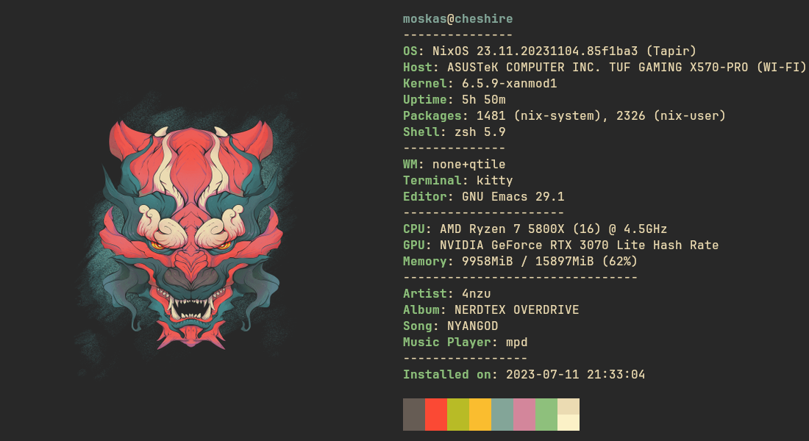
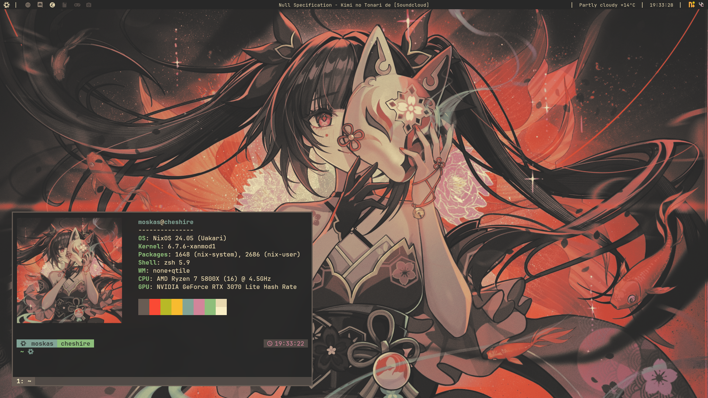

# My NixOS config flakes

[](https://nixos.org/)
[](https://qtile.org/) []()

---


<p align="center"> <i>Cheshire's neofetch</i></p>

## Devices

- Cheshire - my main desktop
- Roon - laptop
- Shimakaze - [NixOS WSL](https://github.com/nix-community/NixOS-WSL) config

> *Yes, these are the names of warships.*

## Flake structure

``` shell
  .
 ├──  hosts # All devices with their corresponding configurations
 │  ├──  cheshire
 │  ├──  glasgow
 │  ├──  laffey
 │  ├──  roon
 │  └──  shimakaze
 └──  modules # All modular configurations like shells, apps etc.
    ├──  apps
    ├──  browsers
    ├──  desktops
    ├──  editors
    ├──  email
    ├──  fonts
    ├──  git
    ├──  media
    ├──  nix
    ├──  nvidia
    ├──  scripts
    ├──  services
    └──  shell
```

## Installation
To install my config you need a NixOS with flakes enabled:
```nix
    nix.settings.experimental-features = [ "nix-command" "flakes" ];
```
After that you need to copy ``hardware-config.nix`` from your current install to the desired host name for example ``hosts/cheshire``.
Then it's the matter of one ``sudo nixos-rebuild switch --flake .#<hostname from flake.nix>`` in the cloned repo directory.  
Although it's the best to just look and copy the desired nix code as it's tailored for me so not everything will work for everyone.


> [!IMPORTANT]
> **I'll be adding the qtile config in the near future as I'm quite happy with it for a while.**  
> My qtile config isn't managed by the flake; it requires manual cloning from my [qtile-config repo](https://github.com/Moskas/qtile-config).
> I'm doing that because I'm constantly tweaking the qtile config, and since having it managed by the flake makes it read-only by default, it's a major inconvenience right now.

If you want to add a managed config for qtile or any other application, you can add it using home-manager with built-in Nix fetchers from git/github/gitea.
Example:
```nix
  home.file = {
    ".config/qtile".source = pkgs.fetchFromGitea {
      domain = "codeberg.org";
      owner = "Moskas";
      repo = "qtile-org";
      rev = "d643434dd9";
      sha256 = "sha256-9wEoLw3/ma1mvt2Jj2xPc6LejP2HIpBzqxQ+h7E50t8=";
    };
  };
```
You can also use config placed in the flake directory and source the configuration directory like so:
```nix
xdg.confileFile.qtile.source = ./qtile;
```

## More screenshots

<p align="center"> <i>cheshire's qtile destkop with gruvbox-dark colorscheme as of 02.03.2024</i></p>

## Why NixOS?
Since I have multiple devices and I'm using some more frequent than others, I've had more than one occurrence of, for example, my laptop being out of date compared to the desktop and just simply missing some of my configs that I have changed in the meantime.  
It was annoying and tedious to keep everything up-to-date on every device, especially when I did install some additional applications on one host, removed some on the other, etc.  
So when I learned about NixOS, I knew that it is something that will help me with that.  
I tested it on my laptop for about half a year, then I decided to fully switch to it on all my devices and jump from ``configuration.nix`` to ``flake.nix`` for even easier device management.  
